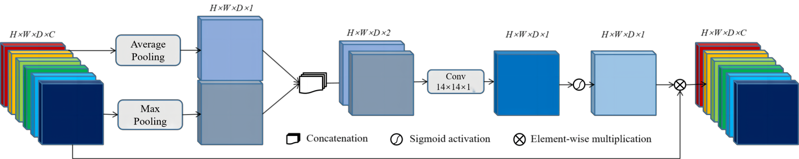

# 3D SA-UNet

**3D SA-UNet: 3D Spatial Attention UNet with 3D Atrous Spatial Pyramid Pooling for White Matter Hyperintensities Segmentation**

<div align="center">
  
  <p><i>Figure: Overview of the proposed 3D SA-UNet architecture</i></p>
</div>

## Abstract

White Matter Hyperintensity (WMH) is a key imaging biomarker associated with neurological conditions such as dementia and stroke. Automatic segmentation of WMH from MRI scans is essential for early diagnosis, but remains challenging due to low contrast, high discontinuity, and poor spatial context of lesions.

To address these issues, we propose **3D SA-UNet**, a deep learning model for WMH segmentation based solely on FLAIR MRI. The model integrates a **3D Spatial Attention Module (3D SAM)** to highlight important lesion features and suppress irrelevant regions, and introduces an extended **3D Atrous Spatial Pyramid Pooling (3D ASPP)** to capture multi-scale contextual information.

Experimental results demonstrate that 3D SA-UNet achieves superior segmentation accuracy compared to state-of-the-art 3D CNN-based models.

> 📌 **Code**: [GitHub Repository](https://github.com/your-repo)

---

## Highlights

- ✅ **3D Spatial Attention Module (3D SAM):** Enhances attention to critical lesion regions in 3D volumes.
  
  
  <p><i>Figure: Structure of the 3D Spatial Attention Module</i></p>

- ✅ **3D ASPP:** Effectively captures multi-scale context using dilated convolutions with varying receptive fields.

  
  <p><i>Figure: 3D Atrous Spatial Pyramid Pooling for multiscale feature fusion</i></p>

- ✅ **Efficient 3D architecture:** Utilizes anisotropic convolution (3×3×1) in encoder/decoder paths to better adapt to the anisotropic resolution of FLAIR images.

- ✅ **Group Normalization:** Improves stability in small-batch training, which is common in 3D medical image segmentation tasks.

---

## Method Overview

Our model follows an encoder–decoder structure similar to 3D U-Net. However, key innovations are:

- 3D SAM modules inserted in skip connections to enhance spatial feature attention.
- A bottleneck with 3D ASPP to capture multi-scale spatial context.
- Asymmetric convolutions (3×3×1) in encoder/decoder paths and full 3×3×3 in bottleneck to balance performance and memory.
- Group Normalization throughout the network to ensure stable training with small batches.

The overall structure is shown below:


<p><i>Figure: 3D SA-UNet architecture with 3D SAM and 3D ASPP components</i></p>

---

## Evaluation

Testing should follow the [official implementation](https://github.com/hjkuijf/wmhchallenge/blob/master/evaluation.py) used in the WMH Segmentation Challenge.

---

## Keywords

> `White Matter Hyperintensity Segmentation` • `Deep Learning` • `3D CNN` • `Spatial Attention` • `ASPP` • `FLAIR MRI`

---

## Citation

If you use this code or find our work helpful, please consider citing:

```bibtex
@article{your2024paper,
  title={3D SA-UNet: 3D Spatial Attention UNet with 3D Atrous Spatial Pyramid Pooling for White Matter Hyperintensities Segmentation},
  author={Your Name, et al.},
  journal={Medical Image Analysis},
  year={2024}
}
